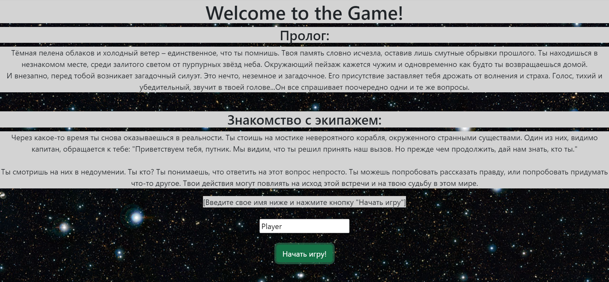

# TextQuest_module_3

## Prologue:
A dark veil of clouds and a cold wind - that's all you remember. Your memory seems to have vanished, leaving only vague fragments of the past. You find yourself in an unfamiliar place, surrounded by the glow of purple stars in the sky. The surrounding landscape appears foreign, yet strangely familiar, as if you're returning home.

Suddenly, a mysterious silhouette appears before you. It's something otherworldly and enigmatic. Its presence makes you tremble with excitement and fear. A voice, soft and compelling, resonates in your mind... It asks the same questions one by one.

